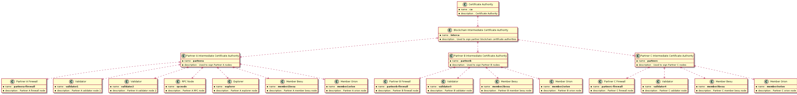

# Besu Scripts

## Generate Keys

## Sample Cert Tree


## Note
Make sure to run with JDK 11 in path, anything higher will result in keystore load related errors like "Algorithm HmacPBESHA256 not available" 

### Might have to install to generate the pkcs11 keystore
```bash
sudo apt install libnss3-tools
```

## Besu Genesis Blockchain Config and Node Keys File Generation 
### [gen-config.sh](gen-config.sh)
This script is used to generate Besu blockchain genesis and node keys files using tls. Copy the contents of the above mentioned export folder to ./files/besu/config/besu/p2p-tls folder in besu-dev-quickstart.

If you run the script without any arguments it should print the usage formats. all of them are optional but tend to look for presence of the besu binary and the config to use to generate the keys. The configuration is generated in the **./generated/generated-config** folder.

The **genesis.json** file has the nodes encoded in the extra data, The **genesis-ne.json** file has the **nothing** encoded in the extra data.

A reccomended option is to run the command twice, first
```bash
./gen-config.sh  -n validators
```
Then copy the generated config and keys. And then run again
```bash
./gen-config.sh  -n members
```
This time just copy the member node keys and use the config from the first run. This was the validators are only encoded in the extra data.

#### There is another set of options to create keys and config used in [quorum-kubernetes - ibft2-tls-r1](https://github.com/perusworld/quorum-kubernetes/tree/master/helm/quorum-besu/ibft2-tls-r1). 
```bash
./gen-config.sh  -n kvalidators
```
Then copy the generated config and keys. And then run again
```bash
./gen-config.sh  -n kmembers
```
Copy the relevant files from the generated folder to ./besu/config/ and ./besu/config/networkFiles folder.

## Key/Cert Gen Scripts
There are a couple of key gen scripts in here. They generate the keys in **./generated/keys** and the corresponding exported version of the keys in **./generated/export**. As of now 3 types of keystore are exported using a combination of openssl, keytool and certutil
* jks
* pkcs11
* pkcs12

Most of the common functions are in [common.sh](common.sh), One can include that in their own scripts to customise the key generation.

### [gen-keys.sh](gen-keys.sh)
This script is used to generate the keys with tls. Copy the contents of the above mentioned export folder to ./files/besu/config/besu/p2p-tls folder in besu-dev-quickstart.

### [gen-test-keys.sh](gen-test-keys.sh)
This script is used to generate the keys used in the [Besu - PKI Module Test Cases](https://github.com/hyperledger/besu/tree/master/pki). Copy the contents of the above mentioned export folder to ./pki/src/test/resources/keystore/ folder in besu.

### [gen-at-keys.sh](gen-at-keys.sh)
This script is used to generate the keys used in the [Besu - Acceptance Test Cases](https://github.com/perusworld/besu/tree/master/acceptance-tests). Copy the contents of the above mentioned export folder to ./tests/src/test/resources/p2p-tls/ folder in besu.

### [gen-k-keys.sh](gen-k-keys.sh)
This script is used to generate the keys used in the [quorum-kubernetes - ibft2-tls-r1](https://github.com/perusworld/quorum-kubernetes/tree/master/helm/quorum-besu/ibft2-tls-r1). Copy the contents of the above mentioned export folder to ./besu/config/p2p-tls folder.
Also because of config map max size issue, you might want to clean up unused files there. Run something like the below in that folder.
```bash
find . -name '*.p12' -exec rm -- '{}' +
find . -name 'nss.cfg' -exec rm -- '{}' +
find . -name 'nssdb' -exec rm -r -- '{}' +
```
### [gen-r1.sh](gen-r1.sh)
This script is used to generate a SECP256r1 key-pair that can be used as a besu wallet or node address with the right configurations. 
